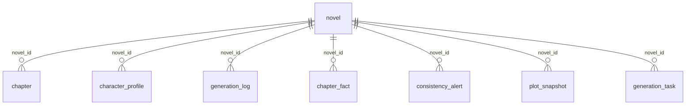

# 数据库结构说明（novel-agent）

本文档根据当前代码中的 JPA 实体（`com.start.agent.model`）整理，便于查阅表字段与业务含义。  
实际列类型、精度与额外索引以运行环境中的 **MySQL + `spring.jpa.hibernate.ddl-auto: update`** 生成结果为准。

---

## 1. 总览

| 逻辑名 | 表名 | 说明 |
|--------|------|------|
| 小说 | `novel` | 小说元数据、大纲摘要、文风流水线、写作工作台状态 |
| 章节 | `chapter` | 章节正文与章节级写入状态 |
| 角色档案 | `character_profile` | 按小说的角色设定条目 |
| 生成日志 | `generation_log` | 各次生成调用的简要记录 |
| 章节事实 | `chapter_fact` | Sidecar、连续性锚点、实体快照等结构化记忆 |
| 一致性告警 | `consistency_alert` | 人名漂移、快照漂移等告警 |
| 剧情快照 | `plot_snapshot` | 阶段性主线摘要 |
| 生成任务 | `generation_task` | 可恢复的异步生成任务（续写/重生/新建） |
| 用户统计 | `user_statistics` | 按用户/群的粗略统计 |

**关系约定（无外键声明，由应用层维护）**

- `chapter.novel_id` → `novel.id`
- `character_profile.novel_id` → `novel.id`
- `generation_log.novel_id` → `novel.id`（可空）
- `chapter_fact.novel_id` → `novel.id`
- `consistency_alert.novel_id` → `novel.id`
- `plot_snapshot.novel_id` → `novel.id`
- `generation_task.novel_id` → `novel.id`

---

## 2. 表结构明细

### 2.1 `novel`

| 列名 | Java 字段 | 约束 / 说明 |
|------|-----------|-------------|
| `id` | `id` | PK，`IDENTITY` |
| `title` | `title` | `NOT NULL` |
| `description` | `description` | `TEXT`，大纲/简介类长文本 |
| `topic` | `topic` | `NOT NULL` |
| `generation_setting` | `generationSetting` | `TEXT`，用户补充设定 |
| `writing_pipeline` | `writingPipeline` | `varchar(40)`，见 §4 `WritingPipeline` |
| `hot_meme_enabled` | `hotMemeEnabled` | `tinyint(1) NOT NULL DEFAULT 0`，全书「少量网络热梗」开关；仅影响后续生成 |
| `user_id` | `userId` | 可空 |
| `group_id` | `groupId` | 可空 |
| `create_time` | `createTime` | 创建时间 |
| `update_time` | `updateTime` | 更新时间 |
| `write_phase` | `writePhase` | `varchar(48) NOT NULL DEFAULT 'IDLE'`，见 §3.1 |
| `write_range_from` | `writeRangeFrom` | 写入任务区间下限（含） |
| `write_range_to` | `writeRangeTo` | 写入任务区间上限（含） |
| `write_cursor_chapter` | `writeCursorChapter` | 当前输出光标章节 |
| `write_phase_detail` | `writePhaseDetail` | `varchar(320)`，给人看的任务说明 |
| `write_started_at` | `writeStartedAt` | 工作台开始时间 |
| `write_updated_at` | `writeUpdatedAt` | 工作台最近更新时间 |

**索引**

- `idx_novel_group_id`：`group_id`
- `idx_novel_user_group`：`user_id, group_id`
- `idx_novel_write_phase`：`write_phase`

---

### 2.2 `chapter`

| 列名 | Java 字段 | 约束 / 说明 |
|------|-----------|-------------|
| `id` | `id` | PK，`IDENTITY` |
| `novel_id` | `novelId` | `NOT NULL` |
| `chapter_number` | `chapterNumber` | `NOT NULL` |
| `title` | `title` | `NOT NULL`，`varchar(200)` |
| `content` | `content` | `TEXT` |
| `generation_setting` | `generationSetting` | `TEXT`，本章续写设定 |
| `write_state` | `writeState` | `varchar(48) NOT NULL DEFAULT 'READY'`，见 §3.2 |
| `write_state_updated_at` | `writeStateUpdatedAt` | 章节写入状态更新时间 |
| `create_time` | `createTime` | 创建时间 |

**索引**

- `idx_chapter_novel_number`：**UNIQUE** `(novel_id, chapter_number)`

---

### 2.3 `character_profile`

| 列名 | Java 字段 | 约束 / 说明 |
|------|-----------|-------------|
| `id` | `id` | PK，`IDENTITY` |
| `novel_id` | `novelId` | `NOT NULL` |
| `character_name` | `characterName` | `NOT NULL`，`varchar(100)` |
| `character_type` | `characterType` | `NOT NULL`，`varchar(50)`（如主角/配角/反派） |
| `profile_content` | `profileContent` | `TEXT` |
| `create_time` | `createTime` | 创建时间 |

---

### 2.4 `generation_log`

| 列名 | Java 字段 | 约束 / 说明 |
|------|-----------|-------------|
| `id` | `id` | PK，`IDENTITY` |
| `novel_id` | `novelId` | 可空 |
| `chapter_number` | `chapterNumber` | 可空 |
| `generation_type` | `generationType` | `NOT NULL`，`varchar(50)`，见 §5 |
| `prompt_length` | `promptLength` | 可空 |
| `response_length` | `responseLength` | 可空 |
| `elapsed_ms` | `elapsedMs` | 可空 |
| `status` | `status` | `NOT NULL`，`varchar(20)`（如 success/failed） |
| `error_message` | `errorMessage` | `TEXT` |
| `create_time` | `createTime` | 创建时间 |

---

### 2.5 `chapter_fact`

| 列名 | Java 字段 | 约束 / 说明 |
|------|-----------|-------------|
| `id` | `id` | PK，`IDENTITY` |
| `novel_id` | `novelId` | `NOT NULL` |
| `chapter_number` | `chapterNumber` | `NOT NULL` |
| `fact_type` | `factType` | `NOT NULL`，`varchar(50)`，见 §6 |
| `subject_name` | `subjectName` | `varchar(100)`，可空 |
| `fact_content` | `factContent` | `TEXT` |
| `create_time` | `createTime` | 创建时间 |

**索引**

- `idx_fact_novel_chapter`：`(novel_id, chapter_number)`

---

### 2.6 `consistency_alert`

| 列名 | Java 字段 | 约束 / 说明 |
|------|-----------|-------------|
| `id` | `id` | PK，`IDENTITY` |
| `novel_id` | `novelId` | `NOT NULL` |
| `chapter_number` | `chapterNumber` | 可空 |
| `alert_type` | `alertType` | `NOT NULL`，`varchar(50)`，见 §7 |
| `severity` | `severity` | `NOT NULL`，`varchar(20)`（如 high/medium/info） |
| `message` | `message` | `TEXT` |
| `auto_fix_attempted` | `autoFixAttempted` | `BOOLEAN`，可空 |
| `auto_fix_success` | `autoFixSuccess` | `BOOLEAN`，可空 |
| `create_time` | `createTime` | 创建时间 |

**索引**

- `idx_alert_novel_chapter`：`(novel_id, chapter_number)`

---

### 2.7 `plot_snapshot`

| 列名 | Java 字段 | 约束 / 说明 |
|------|-----------|-------------|
| `id` | `id` | PK，`IDENTITY` |
| `novel_id` | `novelId` | `NOT NULL` |
| `snapshot_chapter` | `snapshotChapter` | `NOT NULL`，快照锚点章节号 |
| `key_characters` | `keyCharacters` | `varchar(500)` |
| `snapshot_content` | `snapshotContent` | `TEXT` |
| `create_time` | `createTime` | 创建时间 |

**索引**

- `idx_snapshot_novel_chapter`：`(novel_id, snapshot_chapter)`

---

### 2.8 `generation_task`

| 列名 | Java 字段 | 约束 / 说明 |
|------|-----------|-------------|
| `id` | `id` | PK，`IDENTITY` |
| `novel_id` | `novelId` | `NOT NULL` |
| `task_type` | `taskType` | `NOT NULL`，`varchar(48)`，见 §3.3 |
| `status` | `status` | `varchar(32) NOT NULL DEFAULT 'PENDING'`，见 §3.4 |
| `range_from` | `rangeFrom` | 任务章节区间下限 |
| `range_to` | `rangeTo` | 任务章节区间上限 |
| `current_chapter` | `currentChapter` | 进度光标 |
| `payload_json` | `payloadJson` | `TEXT`，任务参数 JSON |
| `retry_count` | `retryCount` | 重试次数，默认 0 |
| `last_error` | `lastError` | `TEXT` |
| `started_at` | `startedAt` | 开始时间 |
| `heartbeat_at` | `heartbeatAt` | 心跳时间 |
| `finished_at` | `finishedAt` | 结束时间 |
| `create_time` | `createTime` | 创建时间 |
| `update_time` | `updateTime` | 更新时间 |

**索引**

- `idx_gen_task_novel`：`novel_id`
- `idx_gen_task_status`：`status`

---

### 2.9 `user_statistics`

| 列名 | Java 字段 | 约束 / 说明 |
|------|-----------|-------------|
| `id` | `id` | PK，`IDENTITY` |
| `group_id` | `groupId` | 可空 |
| `user_id` | `userId` | 可空 |
| `novel_count` | `novelCount` | 默认 0 |
| `chapter_count` | `chapterCount` | 默认 0 |
| `total_words` | `totalWords` | 默认 0 |
| `api_call_count` | `apiCallCount` | 默认 0 |
| `last_active_time` | `lastActiveTime` | 最近活跃 |
| `create_time` | `createTime` | 创建时间 |
| `update_time` | `updateTime` | 更新时间 |

---

## 3. 枚举与状态字段（存库为字符串）

### 3.1 `novel.write_phase` → `NovelWritePhase`

| 取值 | 含义 |
|------|------|
| `IDLE` | 无进行中写作任务 |
| `INITIAL_BOOTSTRAP` | 新建：大纲/角色/前几章 |
| `SINGLE_CONTINUE` | 单章续写 |
| `AUTO_CONTINUE_RANGE` | 批量自动续写 |
| `REGENERATING_RANGE` | 单章或区间重生 |
| `CHARACTER_MAINTENANCE` | 角色档案修复 |

### 3.2 `chapter.write_state` → `ChapterWriteState`

| 取值 | 含义 |
|------|------|
| `READY` | 正常，未被当前批次锁定 |
| `RANGE_RESERVED` | 处于任务锁定区间内 |
| `GENERATING_ACTIVE` | 本章正在生成流水线中 |

### 3.3 `generation_task.task_type` → `GenerationTaskType`

| 取值 | 含义 |
|------|------|
| `INITIAL_BOOTSTRAP` | 可恢复新建 |
| `CONTINUE_SINGLE` | 单章续写任务 |
| `AUTO_CONTINUE_RANGE` | 自动续写到目标章 |
| `REGENERATE_RANGE` | 区间重生 |

### 3.4 `generation_task.status` → `GenerationTaskStatus`

| 取值 | 含义 |
|------|------|
| `PENDING` | 待执行 |
| `RUNNING` | 执行中 |
| `DONE` | 完成 |
| `FAILED` | 失败 |
| `CANCELLED` | 已取消 |

---

## 4. `novel.writing_pipeline` → `WritingPipeline`

库中为字符串（最长 40），典型取值：`POWER_FANTASY`、`LIGHT_NOVEL`、`SLICE_OF_LIFE`、`PERIOD_DRAMA`、`VULGAR`（与枚举 `name()` 一致）。API 另有别名映射（如 `light`、`daily`），入库时以服务端解析结果为准。

---

## 5. `generation_log.generation_type`（代码中出现的取值）

| 取值 | 典型场景 |
|------|----------|
| `outline` | 大纲生成 |
| `character_profile` | 角色档案生成 |
| `character_profile_repair` | 角色档案修复 |
| `chapter` | 章节生成（成功或失败记录） |
| `error` | 创建流程等顶层错误 |

---

## 6. `chapter_fact.fact_type`（代码中出现的取值）

| 取值 | 含义 |
|------|------|
| `sidecar_fact` | Sidecar 结构化事实条目 |
| `continuity_anchor` | 章节衔接锚点 |
| `sidecar_entity` | Sidecar 提取的实体名 |
| `character_state` | 角色状态类记忆 |
| `chapter_hook` | 章节钩子类记忆 |

---

## 7. `consistency_alert.alert_type`（代码中出现的取值）

| 取值 | 含义 |
|------|------|
| `snapshot_drift` | 剧情快照与正文漂移 |
| `name_consistency` | 人名/实体一致性告警 |
| `name_consistency_fix` | 一致性修复尝试结果 |

---

## 8. 实体关系示意（Mermaid）

---

## 9. 维护说明

- 修改字段时请同步更新对应 `@Entity` 与本文档；生产环境若关闭自动 DDL，需另行提供迁移脚本（Flyway/Liquibase 等）。
- `TEXT`、`DATETIME` 等在 MySQL 8 中的具体定义（含 `datetime(6)` 等）以 Hibernate 导出或 `SHOW CREATE TABLE` 为准。

文档生成依据：`src/main/java/com/start/agent/model/*.java`（截至文档编写时的代码版本）。
